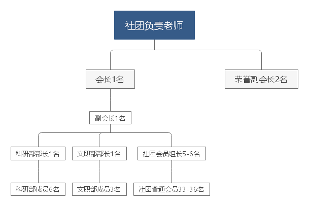

# 物理科学与创新协会秩序册

## 第一章:职务设置

### 成员情况概述

* 所有成员共**51-55**名

  * 大学三年级：会长1名，荣誉副会长2名，共**3**名

  * 大学二年级：副会长1名，科研部部长1名，文职部部长1名，文职部成员3名，科研部成员6名，共**12**名

  * 大学一年级：会员组长5-6名，普通会员33-36名，共**36-40**名

* [权职概览图](./权职图.png)
                                       

### 社团部门成员职务设置

* **会长**
  * 数量：**1**
  * 任职年级：
    * 大学三年级
  * 能力要求
    * 具有较高领导和管理能力
    * 执行力强
    * 具有一定创新和自学能力
  * 职务设置：
    * 负责管理社团的各项规章制度，与老师商定后有修改权
    * 与社团负责老师和书院对接社团**重要**运营策略，并指派给副会长予以执行
    * 根据副会长反应情况与自己对社团成员的实际考察情况，**对于表现情况不良的社团部门成员与社团会员有权免除本年度的创新创业学分与素质学分**，（对于社团副会长以及部门部长反馈**3**次以及以上无故缺勤，失职等情况,包括副会长与社团部长的失职情况,**会长必须立即予以免除本年度各项学分认定并在社团大群进行公告**）并建立学分认定黑名单，上报至书院和社团负责老师
  * 权利
    * 在工科5-621有**固定**公位，帮助学习，考研，科研等
    * 社团最高德育分认定
    * 创新创业学分认定
* **荣誉副会长**
  * 数量：**2**
  * 任职年级：
    * 大学三年级
  * 能力要求
    * 执行力强
    * 具有较高创新和自学能力
  * 职能设置：
    * 协助会长掌握社团的成员的教学情况，比赛进行情况
    * 负责辅助社团部门成员攻克创新比赛问题，为社团部门成员提供技术支持
  * 权利
    * 在工科5-621有**固定**公位，帮助学习，考研，科研等
    * 社团最高德育分认定
    * 创新创业学分认定
* **副会长**

  * 数量：1
  * 任职年级:
    * 大学二年级
  * 能力要求
    * 具有较高管理和领导能力
    * 执行力强
  * 职能设置：
    * 负责对社团事务包括社团成员的值班，单片机学习情况、**科研部部门的每周的教学准备情况**等各项事务的执行情况进行监管，并**每周一晚6点前**以文档形式或文本形式上报至会长，如未按规定时间反馈，需被问责
    * 与文职部部长协同对接书院（需加入书院社团管理群）各项事务如社团年审注册，社团每月总结、书院下方的社团承办活动等，并将根据对接的信息进行分类，然后**直接将任务指派到相应部门部长**，要求其部门内部协同完成
    * 主持每周5晚7点的社团部门全体例会，总结一周内的任务和大家的完成情况进行反思，并要求科研部门成员展示每周教学教学活动。
    * 根据社团大群情况投票确认每周集中教学设定的时间段并在**每周4晚6点**前发布本周的集中教学时间
    * **自身参与考勤**
  * 权利
    * 在工科5-619有**固定**公位，帮助学习，考研，科研等
    * 社团较高德育分认定
    * 创新创业学分认定
* **文职部部长**

  * 数量：**1**
  * 任职年级:
    * 大学二年级
  * 能力要求：
    * 具有较高管理和领导能力
    * 执行力强
    * 有一定文档编写能力
  * 职能设置：
    * 监督文职部部门成员的业务完成情况，并对推脱，未按规矩时间完成以及缺勤等情况**有权向副会长反馈，并在例会中进行汇报总结**
    * 负责在权衡好文职部门成员的空闲情况后**直接指派文职部确定成员（可以同时直接指派多人）**完成社团部门成员以及社团会员的日常值班表的编写以及打印工作
    * 负责对接书院各项文职活动（包括编写活动策划书，社团年审认定，会员注册表，每月上交材料，以及书院要求组织的活动），**并必须接受副会长的指派**，然后在权衡好文职部门成员的空闲情况后**直接指派文职部确定成员（可以同时直接指派多人）**完成任务
    * **自身参与考勤**
  * 权利：
    * 在工科5-619有**固定**公位，帮助学习，考研，科研等
    * 社团较高德育分认定
    * 创新创业学分认定
* **文职部成员**

  * 数量：**3**
  * 任职年级
    * 大学二年级
  * 能力要求：
    * 具有较高文档编写与整理能力
    * 执行力强
    * 具有一定领导能力
  * 职能设置：
    * **必须接受**文职部部长指派的具体文职任务，并按质按量完成
    * 接受指派到的需要组织其他成员协助完成的活动时（如PPT宣讲，各种展示路演），如需要涉及专业知识时，需积极联系科研部人员要求其**协助自身**完成。
    * **参与每周助教**
    * **自身参与考勤**
  * 权利：
    * 在工科5-619有**流动**公位，帮助学习，考研，科研等
    * 社团较高德育分认定
    * 创新创业学分认定
* **科研部部长**

  * 数量：**1**
  * 任职年级:

    * 大学二年级
  * 能力要求：

    * 具有较高管理和领导能力
    * 执行力强
    * 有较高科研与创新能力对参加各类专业科创比赛有浓厚兴趣
  * 职能设置：

    * 监督科研部部门成员的业务完成情况，并对推脱，未按规矩时间完成以及缺勤等情况**有权向副会长反馈，并在例会中进行汇报总结**
    * 负责指定和调整社团的教学大纲，接受并监督科研部成员在**周4中午12点**前完成的本周教学内容，检查其是否按按要求进行准备（**良好的教学内容必须包括，项目简单介绍，项目资源以及下载链接和安装教程，项目源代码，项目展示视频，教学文档和PPT文档为可选项**），**有权要求其补充完整**，并在周**4晚6点**前在社团大群发布检查合格后的教学内容 ，同时接受副会长的监管。
    * 每半个学期开始时集中统计社团参加比赛需要的材料购买（以及临时发现材料以及竞赛工具缺失都要即时进行反馈），整理好材料购买清单并上报给副会长，并交接给老师进行代购
    * 对每周的科研部成员的集中教学情况进行监督并反馈给副会长，同时在每周5例会进行总结集中教学情况
    * **组织本部门成员撰写活动策划书，并交由文职部部门订正格式**
    * 科研部成员制定本周的教学内容，**加强教学内容的务实性以及对科创类专业比赛的针对性**
    * 对于社团必要参加的竞赛活动有权**直接指派科研部确定成员**作为队长进行组织参与
    * 负责协助文职部门完成一些涉及到专业知识的书院宣传和展示活动，并有权**直接指派科研部确定成员（可以同时直接指派多人）**协助完成
    * **自身参与考勤**
  * 权利

    * 在工科5-619有**固定**公位，帮助学习，考研，科研等
    * 社团较高德育分认定
    * 创新创业学分认定
* **科研部成员**
  * 数量：**6**
  * 任职年级
    * 大学二年级
  * 能力要求：
    * 具有较高创新与自学能力
    * 执行力强
    * 对于科创比赛有较高的兴趣
  * 职能设置：
    * **必须接受**科研部部长指派的具体文职任务，并按质按量完成
    * 在上半学期每周按轮换制积极准备教学内容（**良好的教学内容必须包括，项目简单介绍，项目资源以及下载链接和安装教程，项目源代码，项目展示视频，教学文档和PPT文档为可选项**）
    * 在下半学期积极准备各项科创比赛，每周在例会上讨论竞赛准备进度
    * 必要时协助文职部成员完成涉及到专业知识的宣传
    * **自身参与考勤**
  * 权利：
    * 在工科5-619有**流动**公位，帮助学习，考研，科研等
    * 社团较高德育分认定
    * 创新创业学分认定

### 社团普通会员设置

* **会员组长**

  * 数量：**5-6**
* 任职年级:

  * 大学一年级
* 能力要求：

  * 具有一定创新与自学能力
  * 执行力强
  * 对于科创比赛有较高的兴趣
  * 有一定管理和领导能力
* 职能设置：

  * 每周积极组织组内人员参与值班和集体教学活动
  * 管理科创社团给每周分发的学习板等学习材料
  * 带领组内人员积极学习单片机技术
* 权利：

  * 在工科5-611有**流动**公位，帮助学习，考研，科研等
  * 社团一般德育分认定
  * 创新创业学分认定
* **会员**

  * 数量：**33-36**
* 任职年级:

  * 大学一年级
* 能力要求：

  * 具有一定创新与自学能力
  * 执行力强
  * 对于科创比赛有较高的兴趣
* 职能设置：

  * 每周参与值班，积极参加社团组织的教学活动
  * 合理利用社团分配的资源
  * 积极学习单片机技术为参与科创比赛做准备
* 权利：

  * 在工科5-611有**流动**公位，帮助学习，考研，科研等
  * 社团一般德育分认定
  * 创新创业学分认定

### QQ群管理设置

* 每年由副会长建立如下几个QQ群
  * 社团迎新群：成员包括社团所有部门成员，招新成员，在招新完成后整群禁言
  * 社团大群：成员包括社团负责老师、会长、荣誉副会长、上任会长、荣誉副会长、社团所有部门成员、竞选成功的新社员，群名示例：xxx年科创大群
  * 科研部分群：成员包括科研部全体成员，群名示例：xxx年科创科研部分群
  * 文职部分群：成员包括文职部全体成员，群名示例：xxx年科创文职部分群
  * 副会长要求各会员小组长建立本组的交流群，并入群，群名示例：xxx年科创第x小组
* 注意事项
  * 入群者均需要按照要求进行修改备注，**多次提醒无效后直接踢出群**
  * **以上所有群均需公告置顶本秩序册、书院要求字段、社团负责老师联系方式**

## 第二章:社团重要管理事务细则

### 社团招新

* 招新流程

  * 由副会长建立科创迎新大群社团部门成员全体加入
  * 并在群公告中公示此秩序册，并鼓励新生**根据参考学习链接自学C语言和51单片机相关知识**，为面试做准备
  * 副会长要及时指派文职部成员建立线上参与面试的统计表，**项目字段必须设置全面**方便以后归档
  * 文职部成员在招新宣讲前需动员全同社员在QQ空间发布招新文案，**并附有参考学习链接和社团迎新大群二维码**
  * **参考学习链接**

    * [C Primer Plus（第6版中文版）](https://pan.baidu.com/s/19MFUHyfKHP28HiiCnAyjyQ?pwd=1234) 链接：https://pan.baidu.com/s/19MFUHyfKHP28HiiCnAyjyQ?pwd=1234
      提取码：1234
    * [C语言开发环境](https://pan.baidu.com/s/11LPyYMxGg2ceWKaR4MqjCw?pwd=1234) 链接：https://pan.baidu.com/s/11LPyYMxGg2ceWKaR4MqjCw?pwd=1234
      提取码：1234
    * [51单品机项目教程](https://pan.baidu.com/s/1E2UjpU4Nwgv6mXZDgNvnPA?pwd=1234)链接：https://pan.baidu.com/s/1E2UjpU4Nwgv6mXZDgNvnPA?pwd=1234
      提取码：1234
  * 根据书院的时间节点组织完成线下宣讲后，待感兴趣的同学基本加入完毕后**通知科创线下招新面试时间与地点**，时间节点大约为线下宣讲完成后的一周
  * 面试细则

    * 参与面试者需提前打印好面试表
    * 面试表中必须设置有下面两项条例
      * **是否有班中自然职务或者书院组织职务，如有则竞选不优先考虑**
      * **周末是否愿意在实验室学习，如不愿意则竞选不优先考虑**
      * **能力十分突出者可破格考虑**
    * 招新人数
      * 招新面试设置两类
        * 第一类为普通会员，人数限制为**33-36**人，明细见上职务设置
        * 第二类为会员组长，人数限制为**5-6**人,明细见上职务设置
      * 社团招新总人数限制为**36-40**
  * 待面试竞选完成后，副会长指派文职部将面试结果以PDF形式进行公布，成员确定无误后**由副会长建立社团大群，将社团所有部门成员、会长、前任会长、荣誉副会长、社团负责老师、新招新成员拉进大群，并按照班级专业姓名职务的格式修改备注**

### 社团日常值班与考勤

#### 社团普通会员值班

* 会员组长属于社团普通会员范围
* 工科5-611**周内和周天全天对社团所有会员开放**，副会长要履行好监督职责，监督好每天在值社团部门成员早上**8点左右**打开611房门，**晚上10点左右**进行关闭
* 周内社团成员可自愿到工科5-611进行学习科研等，**周天（周6周日）需全天到工科5进行值班**，并按照要求真实填写签到表，**副会长予以监督，对于3次及3次以上未进行值班者副会长必须及时上报给会长，并对会员问责**
* 考勤要求**周天累计值班时间至少5个小时**，视为合格，副会长根据每周值班表上的签到时间和签退时间的时间差进行统计，**每周在科创大群中进行公示**
* 会员小组长在周天要发挥带头作用**积极组织组内人员参与科创的集体教学与值班**，**并管理好科创分发的学习版与各种工具，出现问题要及时联系在619执勤的学长学姐进行解决**

#### 社团部门成员执勤

* 社团部门成员要根据文职部部门制定的值班表，周天周内都进行值班，并受部长和副会长互相监督
* 周天和周内总累计值班**时长为12小时**视为合格

#### 执勤表设置

* 社团普通会员值班表仅设置有周天值班表，设置要求如下
  * 周6和周天每天分为5个时段（下同）
    * 8:00-10:00
    * 10:00-12:00
    * 14:00-16:00
    * 19:00-21:00
  * 周天每天至少要求排两个时间段的班，最好均匀分布
  * 全员参与值班
  * 值班表上至少列有值班时间段、姓名、班级专业、学号、签到时间、签退时间（下同）
  * 值班表按照小组进行分割，**标记有第几小组和小组长的字段**
  * **签退时间以最后离开科创实验室为准**
* 社团部门值班表
  * 周内和周天均要值班
  * 每次值班人数不少于3人
  * 每天**至少排3个班**，最好平均分配到上午、下午、晚上
  * 值班表字段同上要求

### 每周教学

* 成员设置

  * 每周教学为三名部门成员包括1名**科研部主讲**，1名**科研部助教**，1名**文职部助教**共三名部门成员
  * 科研部主讲负责讲授本周所准备的教学内容
  * 科研部助教负责协助科研部主讲完成教学内容，为会员答疑解惑
  * 文职部助教负责整理实验室环境，协助准备材料，对讲课内容进行拍照记录并上传至科创大群
* **教学大纲**

  * 上半学期主要讲授C语言和51单片机
    * 第一节一般为：C语言介绍与开发环境安装
      * 安装C语言简单开发环境
      * 开发环境[Red Panda Dev-C++](https://pan.baidu.com/s/11LPyYMxGg2ceWKaR4MqjCw?pwd=1234) 链接 [https://pan.baidu.com/s/11LPyYMxGg2ceWKaR4MqjCw?pwd=1234](https://pan.baidu.com/s/11LPyYMxGg2ceWKaR4MqjCw?pwd=1234)
      * 打印Hello world
      * C语言基础语法教学
    * 第二节课一般为：51单片机开发相关软件安装与简单使用
      * keil5 安装与破解
      * keil5 链接：https://pan.baidu.com/s/1jcsGyqD-mZmVdzKF89aG1w?pwd=1234
        提取码：1234
      * keil5注册机链接：https://pan.baidu.com/s/1E2Oi45Yiq478uMOLGy9t9w?pwd=1234
        提取码：1234
      * keil5的简单使用
      * Proteus 8 Professional软件的安装与破解 [软件链接](https://pan.baidu.com/s/1AY1fMWyFwN5RzMuEEJ9MPA?pwd=1234) [https://pan.baidu.com/s/1AY1fMWyFwN5RzMuEEJ9MPA?pwd=1234](https://pan.baidu.com/s/1AY1fMWyFwN5RzMuEEJ9MPA?pwd=1234)提取码：1234
      * 结合上面所学内容在Proteus 8 Professional仿真完成点亮第一个LED灯
    * 第三节课和后面的课程一般主要以C51单片机开发为主课程可按照下面PPT资源来设计
      * [51单片机项目教程PPT](https://pan.baidu.com/s/1nXAfyS8NfA-_IYkt-LcbMw?pwd=1234)链接：[https://pan.baidu.com/s/1nXAfyS8NfA-_IYkt-LcbMw?pwd=1234](https://pan.baidu.com/s/1nXAfyS8NfA-_IYkt-LcbMw?pwd=1234)
        提取码：1234
  * 下半学期不开设教学活动
    * 部门成员特别是科研部成员要多去611鼓励值班的同学学习Ardunio和STM32等高级单片机为应用于比赛做准备
      * [Ardunio官网 ](https://www.arduino.cc/)[https://www.arduino.cc/](https://www.arduino.cc/)
      * [Arduio开发集成环境 ](https://www.arduino.cc/en/software)[https://www.arduino.cc/en/software](https://www.arduino.cc/en/software)
      * STM32开发环境Keil MDK-Arm版本[Keil Product Downloads](https://www.keil.com/download/product/)[https://www.keil.com/download/product/](https://www.keil.com/download/product/)
* 教学轮换表

  * 本轮换表由文职部成员编写建立，与上述值班**分别独立执行**
  * 教学采取轮换制，如科研部部门成员6人每人进行编号为A1,A2...,A6，文职部部门成员为3人每人编号为B1,B2,B3,则第一周教学人员为A1(主讲)A2(助教)B1(助教)，第二周A2(主讲)A3(助教)B2(助教)，依次向后轮换，循环往复，除非有不可抗拒因素不可调换，如调换需向本部门部长和副会长请示
  * 文职部成员需在教学开始前按照上述规则排好一个学期的轮换教学表，条目以周为单位，字段分为科研部主讲、科研部助教、文职部助教、教学时间段（这个字段保留空白，在每周副会长确定最终教学时间后，在电子版和打印版上进行更新）**一次性至少排好8周轮换**
  * 教学时间以副会长在群中投票商定好的时间段为准，仅设置一个时间段

### 每周例会

* 每周需副会长在周5晚上7点主持组织社团例会，要求全体部门成员参加
* 例会流程
  * 副会长首先要求文职部部长汇报本周各项表格的统计与打印情况、与书院的对接完成情况、本部门成员的值勤率情况
  * 副会长要求科研部部长汇报上周的教学教学情况与存在的问题、本周的教学准备情况、部门成员执勤率情况
  * 在两大部门汇报完成后，由科研部主讲为全体部门成员进行预讲
  * 文职部部长提前指派好一名文职部成员全程进行拍照记录
  * 会议结束后副会长总结会议中存在的情况，**在周1晚6点前以文档形式或者文本形式反馈给会长**

## 第三章：社团奖惩制度

### 奖励制度

* 德育分认定
* 物理科创协会为物理工程学院直属管理，**具有创新创业学分认定特权**，在社团大一整个学期如何参加值班和社团活动的出勤率良好，则在此学年可获得**1个创新创业学分**，若继续参与科创部门竞选历任科创部门成员，在任职期执勤情况良好并且积极参加社团组织的科创竞赛则**可再获得1分创新创业学分**，我们大学毕业要求通常需要求获得2分创新创业学分，也就是说在科研**如果表现良好满两年就可满足毕业要求！**

### 惩罚制度

* 会长每年会建立**社团学分黑名单**，在社团多次表现不良好均会进入此名单，并会在大群中公示，然后**被免除本学年在科创享有的德育分认定以及创新创业学分认定**，**但不影响下一年的任何评定**
* **表现不良的认定标准**
  * 多次不服从副会长和本部门部长管理的三次及三次以上
  * 在没有特殊情况下，多次不按规定参与值班或教学活动的三次及三次以上

## 第四章：社团资源分配

* 对于社团普通会员，刚入会时社团副会长要分发给每组会员组长一套完整的51单片机学习板，并放置在工科5-611教室交由会员组长管理
* 社团管理人员**必须无偿提供给社团会员学习所需要的合理资源**

## 第五章：科创教学资源汇总与推荐科创比赛条目

### 资源汇总

* 科创资源 链接：https://pan.baidu.com/s/1q67RnmfwYdXuGK8swY8hqg?pwd=1234
  提取码：1234
* keil5 链接：https://pan.baidu.com/s/1jcsGyqD-mZmVdzKF89aG1w?pwd=1234
  提取码：1234
* keil5注册机链接：https://pan.baidu.com/s/1E2Oi45Yiq478uMOLGy9t9w?pwd=1234
  提取码：1234
* 单片机项目教程 链接：https://pan.baidu.com/s/1pFZnGOeE6PnbF1lfTffKxQ?pwd=1234
  提取码：1234
* C语言开发环境 Red Panda Dev-C++ https://pan.baidu.com/s/11LPyYMxGg2ceWKaR4MqjCw?pwd=1234
* Proteus 8 Professional软件的安装与破解 [软件链接](https://pan.baidu.com/s/1AY1fMWyFwN5RzMuEEJ9MPA?pwd=1234) [https://pan.baidu.com/s/1AY1fMWyFwN5RzMuEEJ9MPA?pwd=1234](https://pan.baidu.com/s/1AY1fMWyFwN5RzMuEEJ9MPA?pwd=1234)提取码：1234
* [51单片机项目教程PPT](https://pan.baidu.com/s/1nXAfyS8NfA-_IYkt-LcbMw?pwd=1234)链接：[https://pan.baidu.com/s/1nXAfyS8NfA-_IYkt-LcbMw?pwd=1234](https://pan.baidu.com/s/1nXAfyS8NfA-_IYkt-LcbMw?pwd=1234)
  提取码：1234

### 推荐科创比赛条目

* [中国工程机器人大赛暨国际公开赛 (robotmatch.cn)](http://robotmatch.cn/)
* [全国大学生光电设计竞赛 (zju.edu.cn)](http://opt.zju.edu.cn/gdjs/)
* [全国大学生电子设计大赛](http://nuedc.xjtu.edu.cn/)

## 第六章：秩序册说明与使用手册

* 本秩序册使用[Markdown语法](https://markdown.com.cn/basic-syntax/)编辑,源文件后缀为***.md**,
  * 源文件打开与阅览工具
  * 教程链接->[Markdown 基本语法 | Markdown 官方教程](https://markdown.com.cn/basic-syntax/)
* 文档中蓝色字体均为**超链接**按"**Ctrl+鼠标左键**"均可直接打开前往

* 本秩序册在[GitHub](https://github.com/)上托管有项目仓库,托管仓库->[kielsun/HAUST_Sci_Tech_Association (github.com)](https://github.com/kielsun/HAUST_Sci_Tech_Association)
* Github介绍与简单教程->[『教程』一看就懂！Github基础教程_哔哩哔哩_bilibili](https://www.bilibili.com/video/BV1hS4y1S7wL/?spm_id_from=333.337.search-card.all.click&vd_source=59c385ee7259181c1b5bac3629138181)

* **本秩序册社团负责老师和会长具有修改权限**
* **修改流程**
  * 使用[Git (git-scm.com)](https://git-scm.com/) 工具克隆仓库
  * 签出Dev分支
  * 老师检查合格后
  * 提交合并请求，并附上修改的理由，和修改内容概述
  * 仓库管理者看到合并请求并检查合格后，合并到主分支
* git项目管理工具教程参考B站[git教程--最简洁明了的Git版本控制工具使用教程_哔哩哔哩_bilibili](https://www.bilibili.com/video/BV1TM411M7aL/?spm_id_from=333.337.search-card.all.click&vd_source=59c385ee7259181c1b5bac3629138181)

